# JXL Art

Each picture is a `.jxl` file of at most 1024 bytes. The file holds no pixels, only a JPEG XL decision tree;
the decoder's predictors act as a cellular automaton and compute the image. Sizes are the `.jxl` bytes.

### digits — 177 B

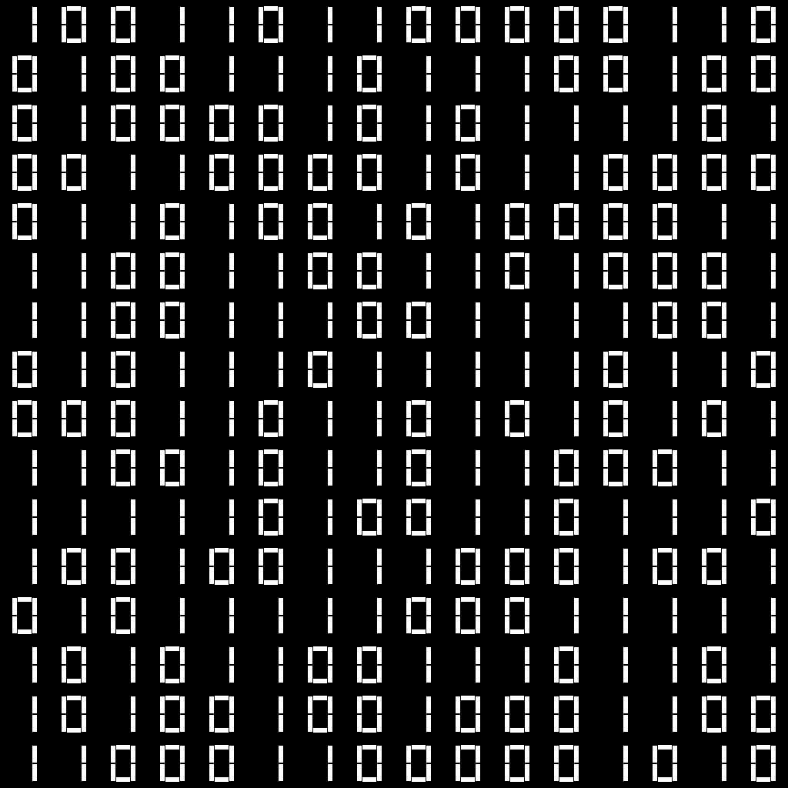

Seven-segment 1s and 0s scattered by a Rule 30 automaton running inside the decoder.

### flag — 222 B


Fifty five-pointed stars and thirteen stripes from six counter channels.

### text — 346 B

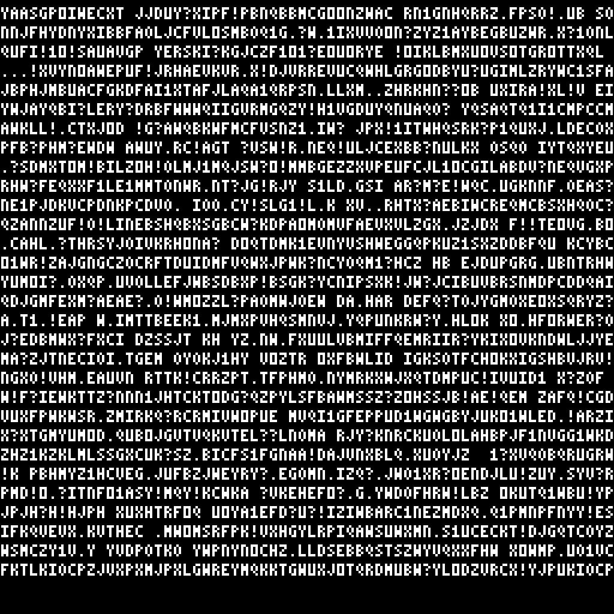

A grid of random letters chosen by Rule 30, drawn with a 3x5 font.

### text_infinity — 524 B

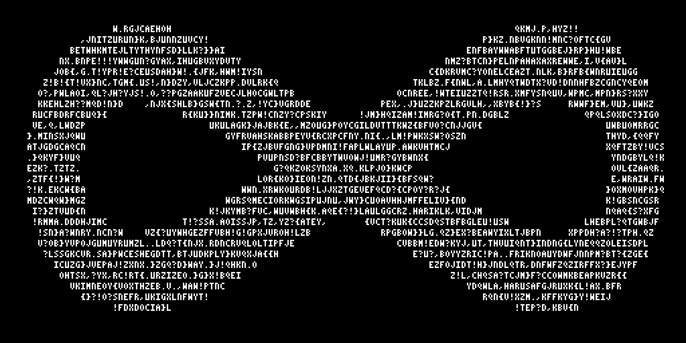

The letters masked by a lemniscate with straight crossing strokes, whole characters only.

### text_infinity_v2 — 602 B

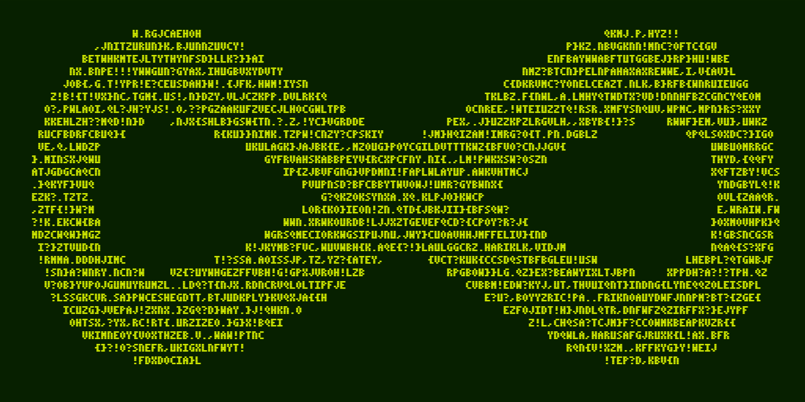

The infinity on a CRT: scanlines and a causal phosphor-trail glow in green-amber.

### jxl_rs — 394 B

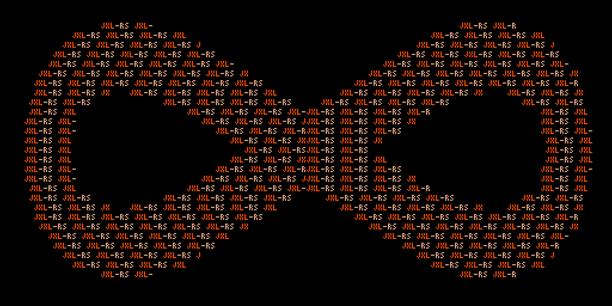

Every run inside the infinity spells JXL-RS in Rust orange and tan; no random channel needed.

### jxl_rs_crt — 485 B

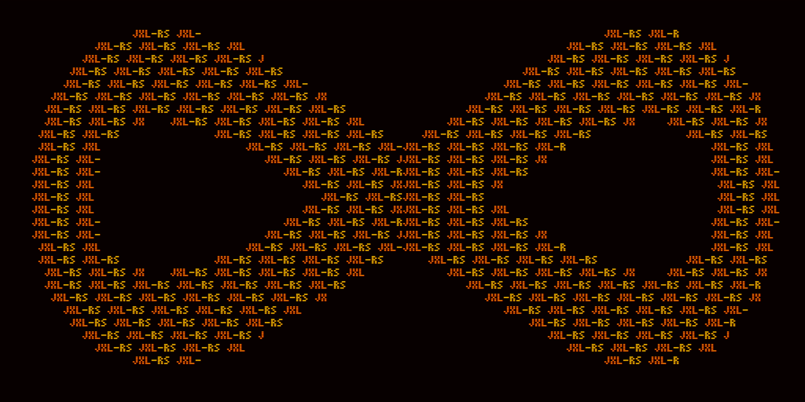

The logo on an amber terminal with scanlines, phosphor trail and 1 px chromatic aberration.

### equations — 556 B

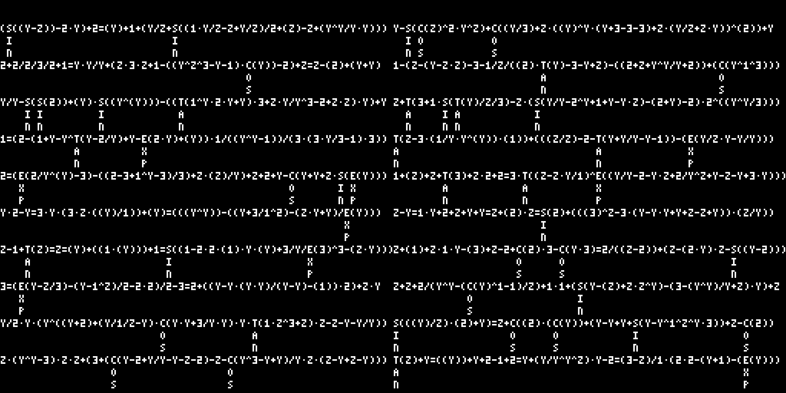

Random well-formed equations from a one-counter grammar; function names hang downward.

### equations_crt — 625 B

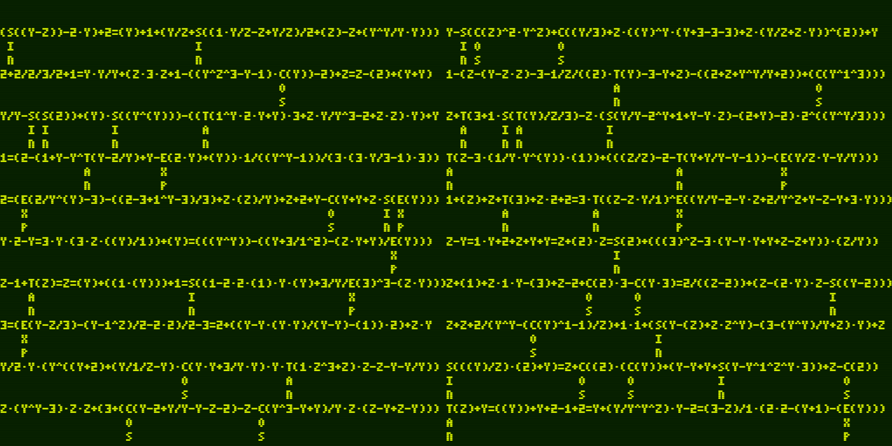

The equations with the CRT scanline and glow treatment.

### equations_v2 — 705 B

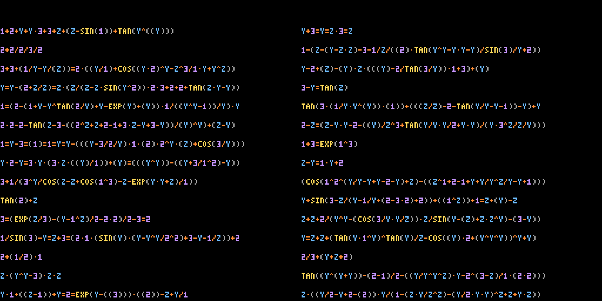

Function names inline, tokens coloured by kind, random lengths, two per row.

### equations_v3 — 652 B

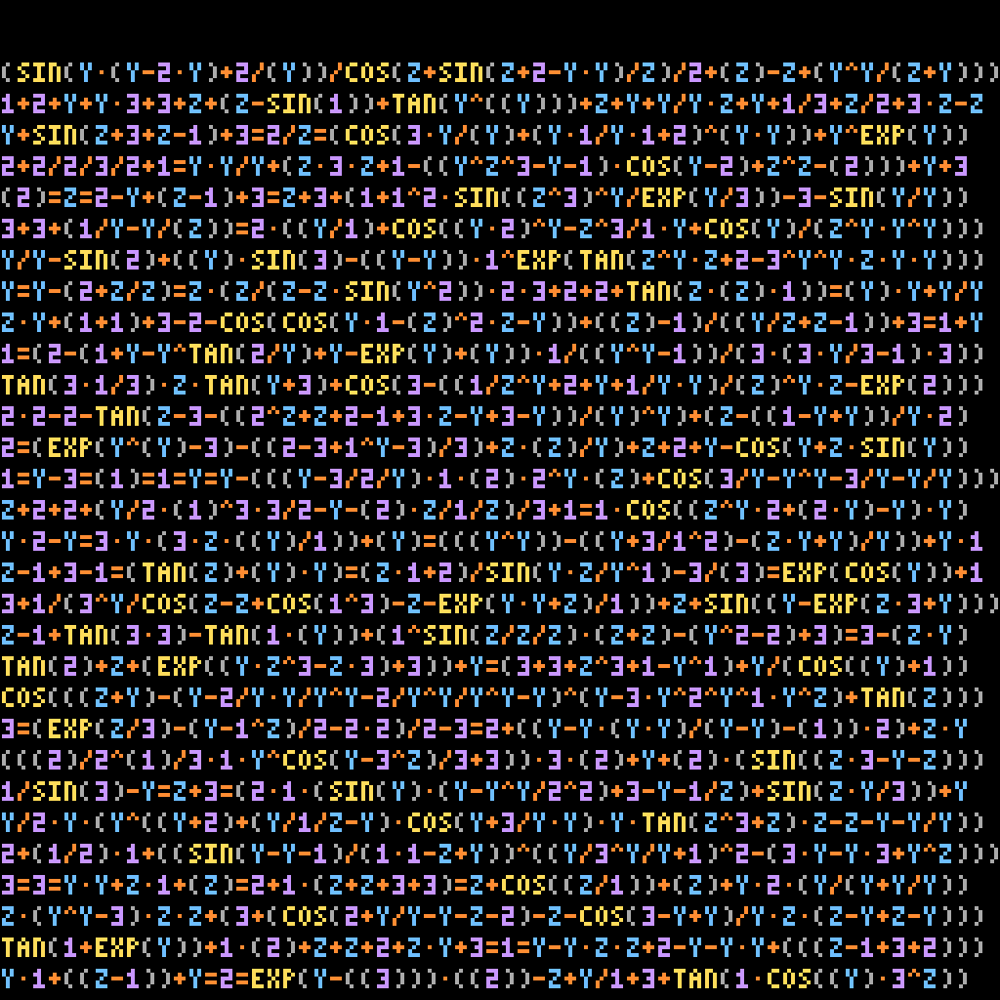

One equation per line on a single 1024 px decoder group.

### equations_v4 — 840 B

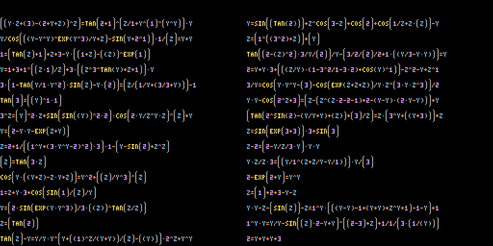

4K: exactly one = per equation, parentheses grow with nesting depth, eight groups seeded differently.

### quotes — 996 B

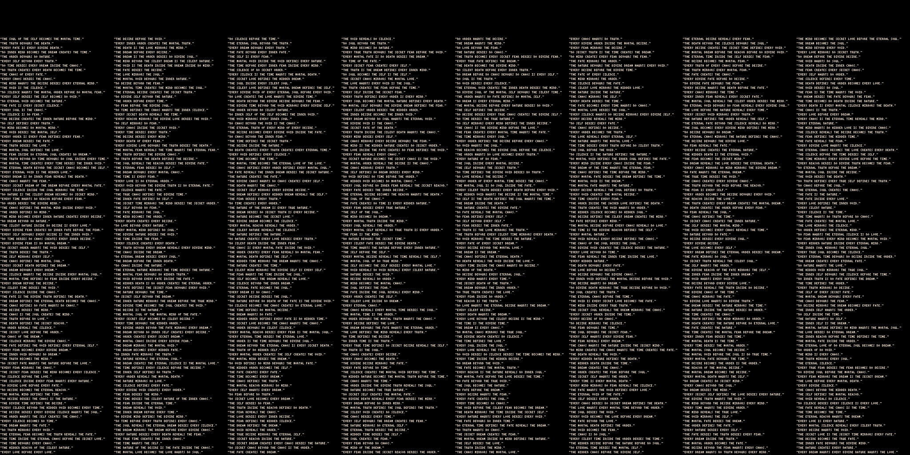

752 pseudo-profound quotes from a madlibs grammar over 42 words, in a 1 px font.

### primes — 415 B

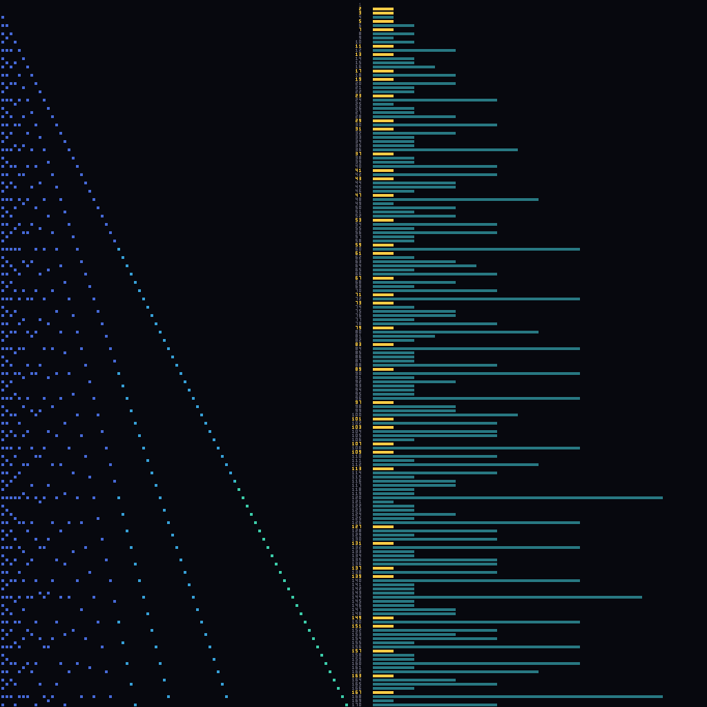

A sieve of Eratosthenes: divisor counters mark composites, labels coloured by primality, divisor bars.

### primes_wall — 902 B

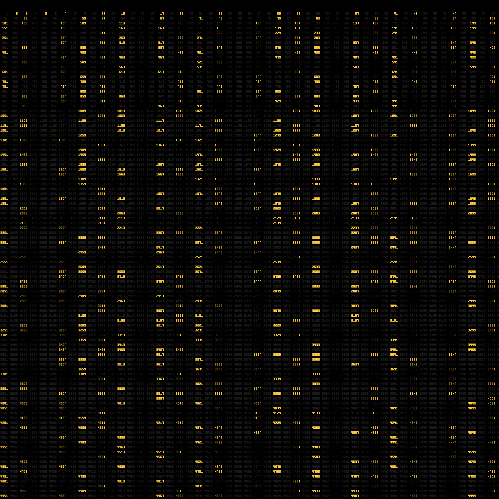

The integers 1 to 5000 with the 669 primes lit; primality computed by 19 divisor counters.

## Build

```
./setup.sh          # installs jpeg-xl and the Python deps
python3.10 art/build.py   # compiles art/trees/*.tree to art/out/
```

The trees are generated by `art/gen_text_tree.py`, `art/gen_primes.py` and `art/gen_primes_wall.py`;
`claude_instructions.md` documents every piece.
